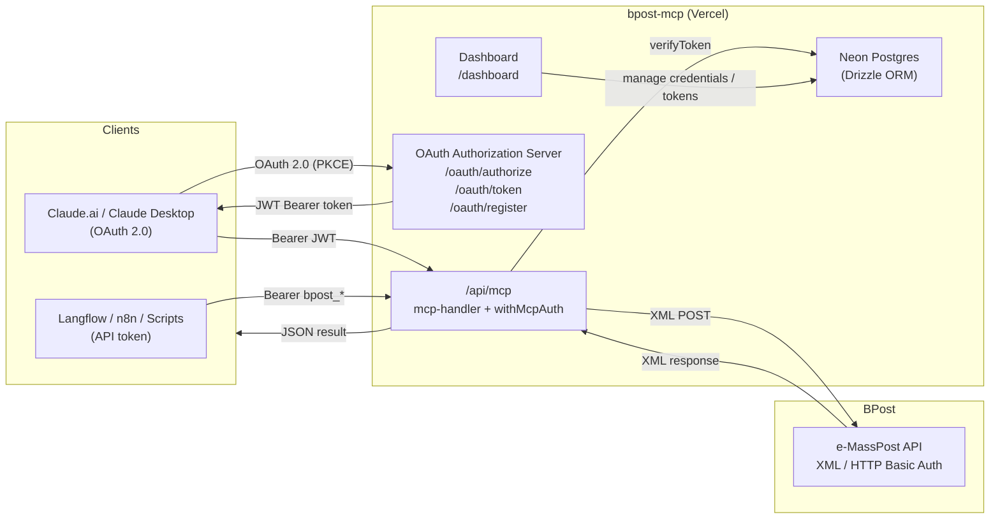
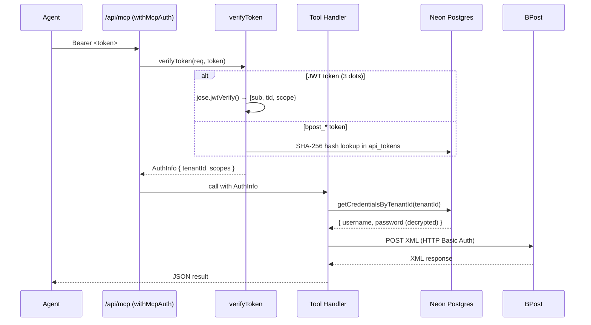
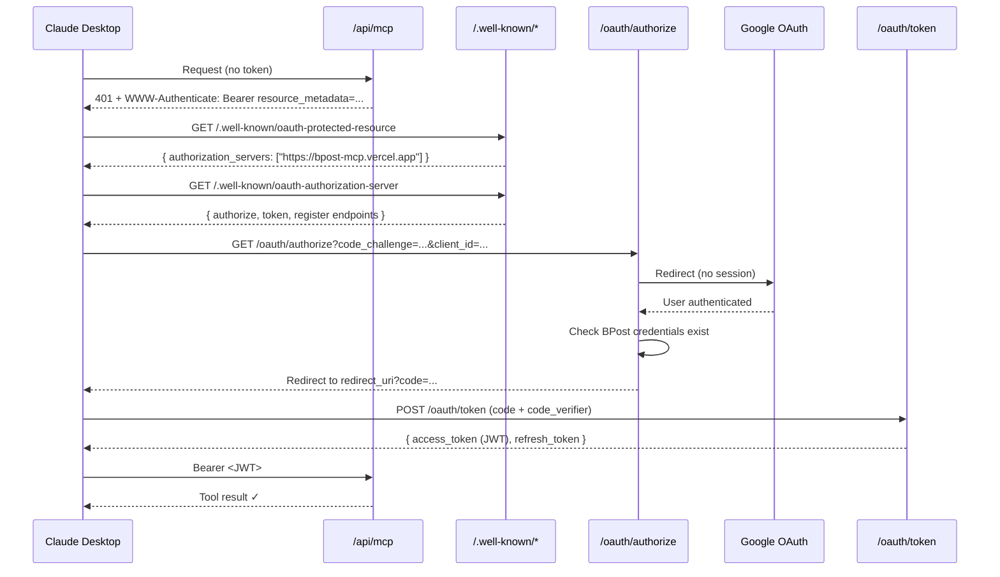
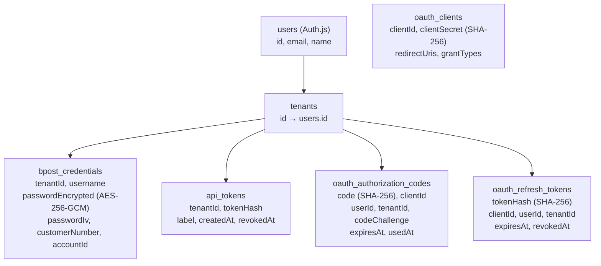
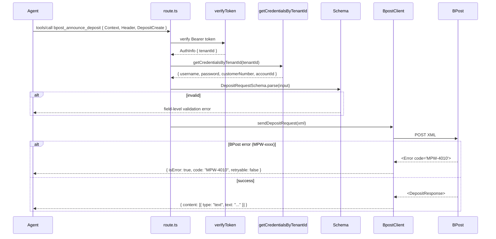

# Architecture Overview

**Current version:** v2.0.0 — Phase 2 Sprint 2 complete
**Last updated:** 2026-04-07

This document describes the full current architecture. For historical context on the Phase 1 design decisions, see [`phase1-architecture.md`](./phase1-architecture.md).

---

## The Big Picture

BPost's **e-MassPost** API requires XML, HTTP Basic Auth, and deep knowledge of BPost-specific field rules. AI agents work in JSON and know none of that.

`bpost-mcp` is the bridge. It sits between AI agents and BPost, handling everything in between:



---

## System Components

### 1. MCP Route (`/api/mcp`)

The entry point for all AI agent calls. Powered by `mcp-handler` with `withMcpAuth`.

- Accepts GET, POST, DELETE (SSE and JSON transport)
- `withMcpAuth` validates the Bearer token before any tool executes
- Two tools registered: `bpost_announce_deposit` and `bpost_announce_mailing`
- After auth, tool handlers fetch BPost credentials via `getCredentialsByTenantId(tenantId)`



### 2. OAuth Authorization Server

A full OAuth 2.1 Authorization Server built as Next.js API routes. Enables Claude.ai/Desktop to log in with Google without any manual token setup.

**Endpoints:**

| Endpoint | Purpose |
|----------|---------|
| `GET /oauth/authorize` | Start OAuth flow — check session, generate auth code |
| `POST /oauth/token` | Exchange auth code or refresh token for JWT access token |
| `POST /oauth/register` | Dynamic Client Registration (RFC 7591) |
| `GET /.well-known/oauth-protected-resource` | RFC 9728 — tells clients where the AS lives |
| `GET /.well-known/oauth-authorization-server` | RFC 8414 — advertises endpoints and capabilities |

**OAuth flow (Claude Desktop):**



**Token types:**

| Type | Format | Lifetime | Storage |
|------|--------|----------|---------|
| JWT access token | `eyJ...` (3 dots) | 1 hour | Stateless — verified with HS256 |
| Refresh token | `ref_...` | 90 days | SHA-256 hash in `oauth_refresh_tokens` |
| M2M API token | `bpost_...` | Until revoked | SHA-256 hash in `api_tokens` |

### 3. Multi-Tenancy & Credential Layer

Every user has a **tenant**. BPost credentials are stored per tenant, encrypted with AES-256-GCM.



The "**agent blinding**" principle: AI agents never receive BPost usernames or passwords. Credentials are fetched inside the MCP server after token verification and used only for the outbound HTTP call.

### 4. Dashboard (`/dashboard`)

A terminal-style web UI for tenants to self-manage:

- **BPost Credentials** — enter/update BPost username, password, customer number, account ID
- **API Tokens** — generate `bpost_*` tokens for Langflow/n8n/scripts
- **Claude / MCP Clients** — copy the MCP URL to paste into Claude Desktop

Protected by Auth.js v5 (Google OAuth session). `signOut` is a server action.

---

## Request Flow: Tool Execution



---

## Authentication Summary

Two authentication systems coexist:

| System | Who uses it | How it works |
|--------|-------------|--------------|
| **Auth.js (Google OAuth)** | Dashboard users | Google login → session cookie → access to `/dashboard` |
| **OAuth 2.0 (MCP)** | Claude.ai / Claude Desktop | Google login → JWT access token → Bearer header on MCP calls |
| **API tokens (M2M)** | Langflow, n8n, scripts | Manual token from dashboard → `bpost_*` Bearer header on MCP calls |

The OAuth 2.0 MCP flow uses Auth.js under the hood for the identity step (Google login). After the user is authenticated via Google, the OAuth Authorization Server issues its own JWT — Auth.js sessions are not shared with MCP clients.

---

## Security Properties

| Property | Implementation |
|----------|---------------|
| PKCE mandatory | `/oauth/authorize` rejects requests without `code_challenge` |
| Auth code replay prevention | `used_at` set on first exchange; second use rejected |
| Refresh token rotation | Old token revoked before new token issued |
| JWT verification | `jose.jwtVerify()` — checks signature, expiry, issuer, audience |
| Secrets never stored raw | All tokens/codes stored as SHA-256 hashes |
| BPost password encrypted | AES-256-GCM with per-row IV; `ENCRYPTION_KEY` env var |
| Agent blinding | AI never sees BPost credentials — fetched server-side after auth |
| Scope enforcement | `withMcpAuth` enforces `requiredScopes: ['mcp:tools']` |

---

## File Map (Current)

```
bpost-mcp/
│
├── src/
│   ├── app/
│   │   ├── api/mcp/
│   │   │   └── route.ts              ← MCP endpoint (mcp-handler + withMcpAuth)
│   │   ├── oauth/
│   │   │   ├── authorize/route.ts    ← OAuth authorization endpoint
│   │   │   ├── token/route.ts        ← OAuth token endpoint
│   │   │   └── register/route.ts     ← Dynamic Client Registration
│   │   ├── .well-known/
│   │   │   ├── oauth-protected-resource/route.ts  ← RFC 9728
│   │   │   └── oauth-authorization-server/route.ts ← RFC 8414
│   │   ├── dashboard/
│   │   │   └── page.tsx              ← Tenant self-service UI
│   │   └── layout.tsx                ← Root layout (favicons, metadata)
│   │
│   ├── lib/
│   │   ├── auth.ts                   ← Auth.js v5 config (Google provider)
│   │   ├── crypto.ts                 ← AES-256-GCM encrypt/decrypt, hashToken
│   │   ├── db/
│   │   │   ├── client.ts             ← Drizzle + Neon connection
│   │   │   └── schema.ts             ← All table definitions
│   │   ├── oauth/
│   │   │   ├── jwt.ts                ← signAccessToken / verifyAccessToken (jose)
│   │   │   ├── pkce.ts               ← verifyPkceS256
│   │   │   ├── client-resolver.ts    ← Resolve client_id (metadata doc or DB)
│   │   │   └── verify-token.ts       ← Unified token verification (JWT + bpost_*)
│   │   └── tenant/
│   │       ├── resolve.ts            ← resolveTenant (M2M token → credentials)
│   │       └── get-credentials.ts    ← getCredentialsByTenantId
│   │
│   ├── client/
│   │   ├── bpost.ts                  ← BpostClient (XML HTTP calls)
│   │   └── errors.ts                 ← BpostError + parseBpostError
│   │
│   └── schemas/                      ← Zod schemas (from BPost XSDs)
│       ├── common.ts
│       ├── deposit-request.ts
│       └── mailing-request.ts
│
├── tests/                            ← Vitest test suite (102 tests)
│
├── drizzle/                          ← Generated SQL migrations
│
├── docs/
│   ├── internal/
│   │   ├── architecture.md           ← This file
│   │   ├── phase1-architecture.md    ← Phase 1 detailed design
│   │   ├── project-design.md         ← Decision log and constraints
│   │   ├── vision.md                 ← Roadmap (3 phases)
│   │   └── e-masspost/               ← BPost protocol docs (git submodule)
│   └── samples/                      ← Example JSON/XML payloads
│
└── .agent/
    ├── plans/                        ← Implementation plans (INDEX.md)
    └── skills/                       ← Agent skill files
```

---

## Technology Stack

| What | Tool | Why |
|------|------|-----|
| **Web framework** | Next.js 16 (App Router) | Vercel deployment, clean API routes, server actions |
| **MCP server** | `mcp-handler` | `withMcpAuth` + `protectedResourceHandler` out of the box |
| **Auth (dashboard)** | Auth.js v5 | Google OAuth, session management, Drizzle adapter |
| **JWT** | `jose` | Lightweight, zero deps, HS256 signing/verification |
| **Database** | Neon Postgres + Drizzle ORM | Serverless Postgres, type-safe queries |
| **Validation** | Zod v4 | Runtime validation + TypeScript types from one schema |
| **XML** | `fast-xml-parser` v5 | ISO-8859-1 support, predictable JS objects |
| **Tests** | Vitest 4 | TypeScript-native, fast, `@/` aliases via vite-tsconfig-paths |
| **Hosting** | Vercel | Serverless, zero-config Next.js, preview deploys on push |

---

## Environment Variables

| Variable | Required | Purpose |
|----------|----------|---------|
| `DATABASE_URL` | ✅ | Neon Postgres connection string |
| `AUTH_SECRET` | ✅ | Auth.js session signing key |
| `AUTH_GOOGLE_ID` | ✅ | Google OAuth client ID |
| `AUTH_GOOGLE_SECRET` | ✅ | Google OAuth client secret |
| `ENCRYPTION_KEY` | ✅ | AES-256-GCM key for BPost passwords (base64, 32 bytes) |
| `OAUTH_JWT_SECRET` | ✅ | HS256 JWT signing key (base64, 32 bytes) |
| `NEXT_PUBLIC_BASE_URL` | ✅ | Public URL (e.g. `https://bpost-mcp.vercel.app`) |

---

## What's Not Built Yet

| Item | Location | Notes |
|------|----------|-------|
| DCR rate limiting | `src/app/oauth/register/route.ts` | Max 10 registrations/IP/hour — TODO comment |
| Expired auth code cleanup | DB `oauth_authorization_codes` | No cron job yet — rows accumulate |
| Phase 2 self-learning pipeline | `.agent/plans/INDEX.md` | Next sprint |
| Phase 3: enterprise automation | `docs/internal/vision.md` | Future |
