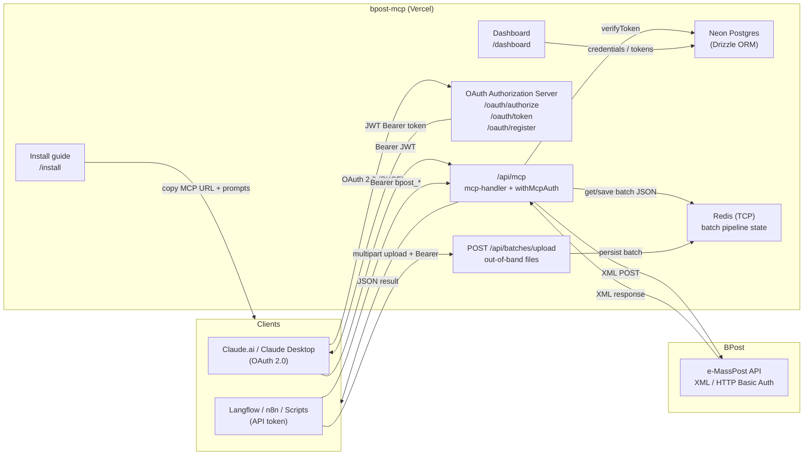
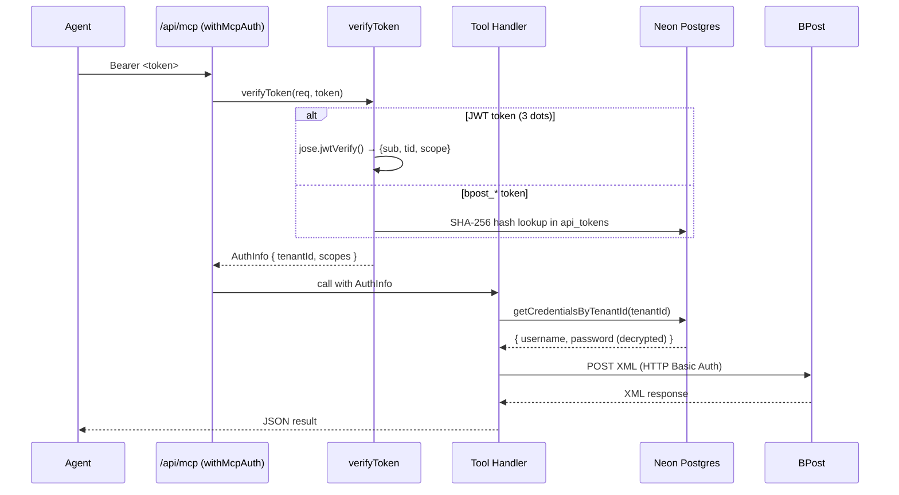
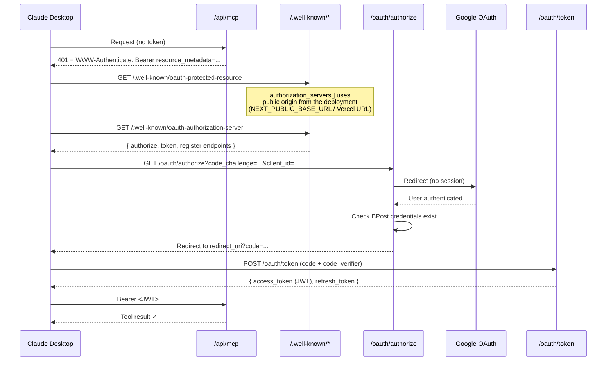
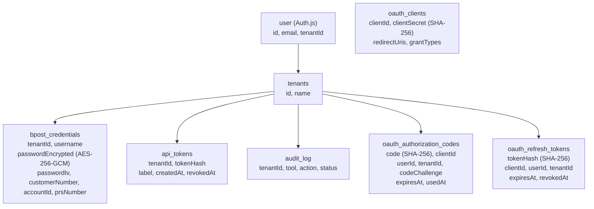
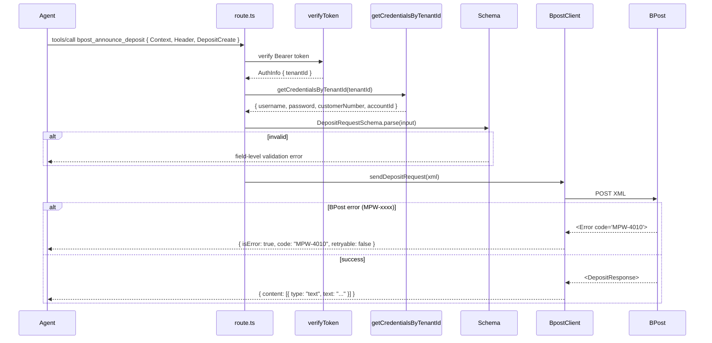

# Architecture Overview

**Current state:** Phase 2 Sprint 3 complete — multi-tenant MCP, OAuth for Claude clients, batch CSV/XLSX pipeline (Redis), self-learning / feedback MCP tools, and public install onboarding. See [`.agent/plans/INDEX.md`](../../.agent/plans/INDEX.md) for plan status.

**Last updated:** 2026-04-12

This document describes the full current architecture. For historical context on the Phase 1 design decisions, see [`phase1-architecture.md`](./phase1-architecture.md).

---

## The Big Picture

BPost's **e-MassPost** API requires XML, HTTP Basic Auth, and deep knowledge of BPost-specific field rules. AI agents work in JSON and know none of that.

`bpost-mcp` is the bridge. It sits between AI agents and BPost, handling everything in between:



---

## System Components

### 1. MCP Route (`/api/mcp`)

The entry point for all AI agent calls. Powered by `mcp-handler` with `withMcpAuth`.

- Accepts GET, POST, DELETE (SSE and JSON transport)
- `withMcpAuth` validates the Bearer token before any tool executes
- **Server metadata:** `serverInfo` (name + version from `src/lib/app-version.ts`) and **chat `instructions`** (`src/lib/mcp/server-instructions.ts`) — Flemish, non-technical guidance for end users in MCP clients
- Tool handlers that need a tenant call `requireTenantId(extra)` so unauthenticated edge cases return a structured MCP error instead of throwing

**Registered tools (grouped):**

| Group | Tools |
|-------|--------|
| **BPost core** | `bpost_announce_deposit`, `bpost_announce_mailing` — Zod-validated JSON → XML → `BpostClient`; credentials injected after auth |
| **Diagnostics** | `get_service_info` — service name + semantic version |
| **Self-learning & feedback** | `add_protocol_rule` (append to submodule knowledge file), `create_fix_script` / `apply_fix_script` (saved scripts under `scripts/auto-fixers/`, sandboxed `vm` run), `report_issue` (GitHub issue or prefilled URL via `src/lib/github/report-issue.ts`) |
| **Batch pipeline** | `get_upload_instructions`, `get_raw_headers`, `apply_mapping_rules`, `get_batch_errors`, `apply_row_fix`, `submit_ready_batch` — state in **Redis** (`src/lib/kv/client.ts`); upload via `POST /api/batches/upload` with Bearer token |

<<<<<<< HEAD
**Note:** `submit_ready_batch` currently returns a **stub** response after marking the batch submitted; wiring full BPost XML dispatch for all ready rows is still outstanding.
=======
`submit_ready_batch` builds a full `MailingCreate` XML envelope from mapped batch rows via `src/lib/batch/submit-batch.ts`, sends to BPost, and stores submission metadata (mailingRef, row counts, BPost status, audit fields) in the batch state.
>>>>>>> develop

After auth, BPost credential tools fetch secrets via `getCredentialsByTenantId(tenantId)` (never returned to the model).



### 2. OAuth Authorization Server

A full OAuth 2.1 Authorization Server built as Next.js API routes. Enables Claude.ai/Desktop to log in with Google without any manual token setup.

**Endpoints:**

| Endpoint | Purpose |
|----------|---------|
| `GET /oauth/authorize` | Start OAuth flow — check session, generate auth code |
| `POST /oauth/token` | Exchange auth code or refresh token for JWT access token |
| `POST /oauth/register` | Dynamic Client Registration (RFC 7591) |
| `GET /.well-known/oauth-protected-resource` | RFC 9728 — tells clients where the AS lives |
| `GET /.well-known/oauth-authorization-server` | RFC 8414 — advertises endpoints and capabilities |

**OAuth flow (Claude Desktop):**



**Token types:**

| Type | Format | Lifetime | Storage |
|------|--------|----------|---------|
| JWT access token | `eyJ...` (3 dots) | 1 hour | Stateless — verified with HS256 |
| Refresh token | `ref_...` | 90 days | SHA-256 hash in `oauth_refresh_tokens` |
| M2M API token | `bpost_...` | Until revoked | SHA-256 hash in `api_tokens` |

### 3. Multi-Tenancy & Credential Layer

Tenants own BPost credentials and API tokens. Dashboard users (`user` rows from Auth.js) link to a tenant via `users.tenantId`. BPost passwords are stored encrypted with AES-256-GCM.



The "**agent blinding**" principle: AI agents never receive BPost usernames or passwords. Credentials are fetched inside the MCP server after token verification and used only for the outbound HTTP call.

### 4. Batch uploads & Redis

Large spreadsheets are **not** passed through the MCP JSON channel. The agent (or user) uploads a file with `curl` to `POST /api/batches/upload` using the same Bearer token. Parsed rows and headers are stored under a tenant-scoped key in **Redis** (`REDIS_URL`, `redis` npm package — e.g. Vercel Marketplace Redis). MCP tools read/write that state for mapping, validation, row fixes, and (eventually) submission.

- Row cap and size constraints are enforced at upload (see upload route and plans under `.agent/plans/` for history)
- If `REDIS_URL` is unset, batch tools and upload fail fast with a clear configuration error

### 5. Dashboard (`/dashboard`) & install (`/install`)

- **Dashboard** — Terminal-style UI: BPost credentials, API tokens (`bpost_*`), MCP URL hints. Protected by Auth.js v5 (Google OAuth session). Server actions in `src/app/dashboard/actions.ts`.
- **Install** — Public `/install` page and `GET /api/install/prompt` for copy-ready connection instructions (OAuth vs bearer token), backed by `src/lib/install/load-install-prompt.ts` and `docs/install/install-prompt.md`.

---

## Request Flow: Tool Execution



---

## Authentication Summary

Two authentication systems coexist:

| System | Who uses it | How it works |
|--------|-------------|--------------|
| **Auth.js (Google OAuth)** | Dashboard users | Google login → session cookie → access to `/dashboard` |
| **OAuth 2.0 (MCP)** | Claude.ai / Claude Desktop | Google login → JWT access token → Bearer header on MCP calls |
| **API tokens (M2M)** | Langflow, n8n, scripts | Manual token from dashboard → `bpost_*` Bearer header on MCP calls |

The OAuth 2.0 MCP flow uses Auth.js under the hood for the identity step (Google login). After the user is authenticated via Google, the OAuth Authorization Server issues its own JWT — Auth.js sessions are not shared with MCP clients.

---

## Security Properties

| Property | Implementation |
|----------|---------------|
| PKCE mandatory | `/oauth/authorize` rejects requests without `code_challenge` |
| Auth code replay prevention | `used_at` set on first exchange; second use rejected |
| Refresh token rotation | Old token revoked before new token issued |
| JWT verification | `jose.jwtVerify()` — checks signature, expiry, issuer, audience |
| Secrets never stored raw | All tokens/codes stored as SHA-256 hashes |
| BPost password encrypted | AES-256-GCM with per-row IV; `ENCRYPTION_KEY` env var |
| Agent blinding | AI never sees BPost credentials — fetched server-side after auth |
| Scope enforcement | `withMcpAuth` enforces `requiredScopes: ['mcp:tools']` |
| Fix scripts | `apply_fix_script` runs user-written code in `vm.runInNewContext` with timeout; scripts are kebab-case names only |

---

## Configuration

**`src/lib/config/env.ts`** — Zod-validated access for **`NEXT_PUBLIC_BASE_URL`** (resolved from env + `VERCEL_URL` + local fallback), **`OAUTH_JWT_SECRET`**, optional **`REDIS_URL`** and **`GITHUB_TOKEN`**. Application code should prefer `import { env } from '@/lib/config/env'` for these values so misconfiguration fails fast at boot.

**Database URL** — `src/lib/db/client.ts` and `drizzle.config.ts` read **`BPOST_DB_DATABASE_URL`** or **`DATABASE_URL`** (Neon / Vercel integration). Other secrets (`AUTH_*`, `ENCRYPTION_KEY`, etc.) are read where used (Auth.js, crypto layer); keep `.env.example` in sync when adding variables.

---

## File Map (Current)

```
bpost-mcp/
│
├── src/
│   ├── app/
│   │   ├── api/mcp/route.ts              ← MCP handler, all tools, server instructions
│   │   ├── api/batches/upload/route.ts   ← Multipart CSV/XLSX ingest → Redis
│   │   ├── api/install/prompt/route.ts   ← Install prompt markdown for clients
│   │   ├── api/auth/[...nextauth]/route.ts
│   │   ├── oauth/authorize|token|register/route.ts
│   │   ├── .well-known/oauth-*/route.ts
│   │   ├── dashboard/page.tsx, actions.ts, TokenRow.tsx
│   │   ├── install/page.tsx, CopyInstallPromptButton.tsx
│   │   ├── page.tsx, layout.tsx
│   │   └── components/customer/           ← Shared customer UI (banners, copy blocks)
│   │
│   ├── lib/
│   │   ├── config/env.ts                  ← Zod env (public URL, OAuth JWT, Redis, GitHub)
│   │   ├── auth.ts                        ← Auth.js v5
│   │   ├── crypto.ts
│   │   ├── xml.ts                         ← fast-xml-parser singleton
│   │   ├── db/client.ts, schema.ts
│   │   ├── oauth/ (jwt, pkce, verify-token, client-resolver, resource-url)
│   │   ├── tenant/ (resolve, get-credentials)
│   │   ├── mcp/ (server-instructions, require-tenant)
│   │   ├── kv/client.ts                   ← Redis batch state
<<<<<<< HEAD
│   │   ├── batch/ (apply-mapping, validate-mapping-targets)
=======
│   │   ├── batch/ (apply-mapping, validate-mapping-targets, submit-batch)
>>>>>>> develop
│   │   ├── github/report-issue.ts
│   │   ├── install/load-install-prompt.ts
│   │   └── app-version.ts
│   │
│   ├── client/bpost.ts, errors.ts
│   └── schemas/                          ← Zod (deposit/mailing + responses, common)
│
├── scripts/                               ← seed, auto-fixers written by MCP tools
├── tests/                                 ← Vitest
├── drizzle/
├── docs/internal/, docs/install/, docs/samples/
└── .agent/plans/, .agent/skills/
```

---

## Technology Stack

| What | Tool | Why |
|------|------|-----|
| **Web framework** | Next.js 16 (App Router) | Vercel deployment, API routes, server actions |
| **MCP server** | `mcp-handler` | `withMcpAuth` + `protectedResourceHandler` out of the box |
| **Auth (dashboard)** | Auth.js v5 | Google OAuth, session management, Drizzle adapter |
| **JWT** | `jose` | Lightweight, HS256 signing/verification |
| **Database** | Neon Postgres + Drizzle ORM | Serverless Postgres, type-safe queries |
| **Cache / batch state** | `redis` (TCP) | Tenant-scoped batch JSON between upload and MCP tools |
| **Spreadsheet ingest** | `papaparse` (+ upload route) | CSV parsing; XLSX path as implemented in upload route |
| **Validation** | Zod v4 | Runtime validation + TypeScript types |
| **XML** | `fast-xml-parser` v5 | ISO-8859-1 support, predictable JS objects |
| **Tests** | Vitest | TypeScript-native, `@/` aliases |
| **Hosting** | Vercel | Serverless, preview deploys on push |

---

## Environment Variables

| Variable | Required | Purpose |
|----------|----------|---------|
| `BPOST_DB_DATABASE_URL` or `DATABASE_URL` | ✅ (runtime) | Neon Postgres connection string |
| `AUTH_SECRET` | ✅ | Auth.js session signing key |
| `AUTH_GOOGLE_ID` / `AUTH_GOOGLE_SECRET` | ✅ | Google OAuth for dashboard + OAuth AS login |
| `ENCRYPTION_KEY` | ✅ | AES-256-GCM key for BPost passwords (base64, 32 bytes) |
| `OAUTH_JWT_SECRET` | ✅ | HS256 JWT signing key (validated in `env.ts`) |
| `NEXT_PUBLIC_BASE_URL` | ✅ (recommended) | Canonical public URL; validated in `env.ts`. On Vercel, `VERCEL_URL` can supply a default if unset |
| `REDIS_URL` | ✅ for batch features | TCP Redis for batch pipeline |
| `GITHUB_TOKEN` | Optional | PAT for `report_issue` to create GitHub issues automatically |

---

## What's Not Built Yet

| Item | Location | Notes |
|------|----------|-------|
| DCR rate limiting | `src/app/oauth/register/route.ts` | Max registrations/IP/hour — TODO / partial |
| Expired auth code cleanup | `oauth_authorization_codes` | No cron job yet — rows accumulate |
<<<<<<< HEAD
| `submit_ready_batch` → BPost | `src/app/api/mcp/route.ts` | Stub only; real XML mailing dispatch for batched rows TBD |
=======
| `check_batch` (OptiAddress) | Issue #13 | Pre-validate addresses via MailingCheck before MailingCreate |
>>>>>>> develop
| Phase 3: enterprise automation | `docs/internal/vision.md` | Future |
