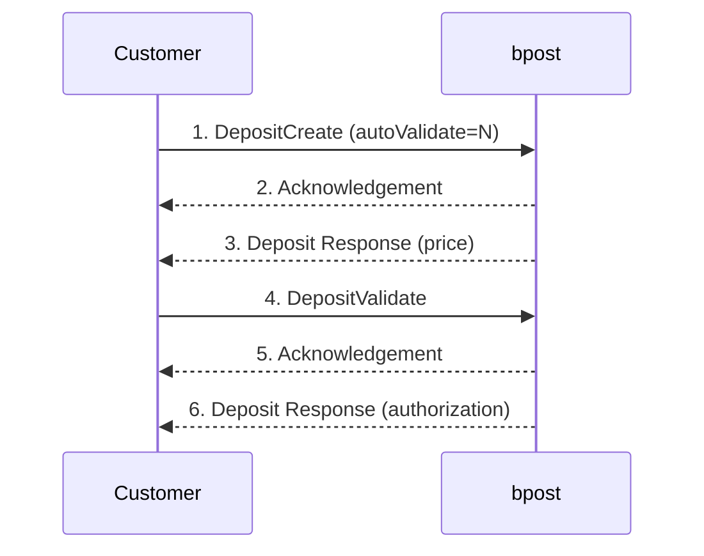
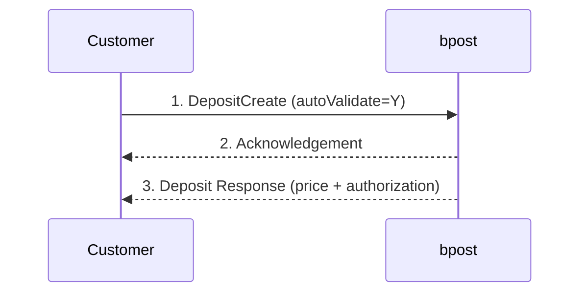
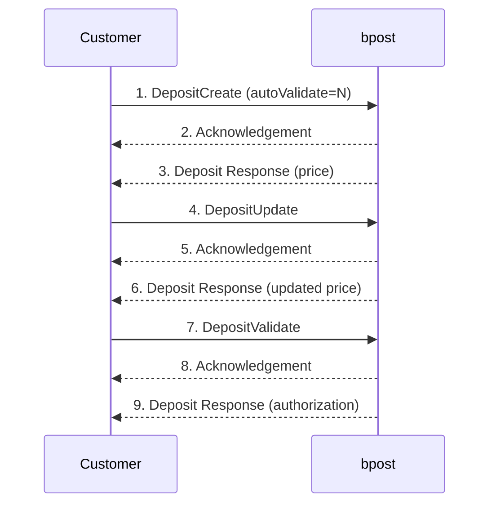
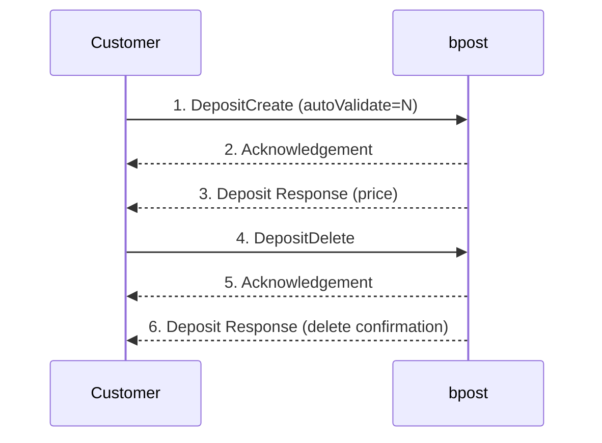
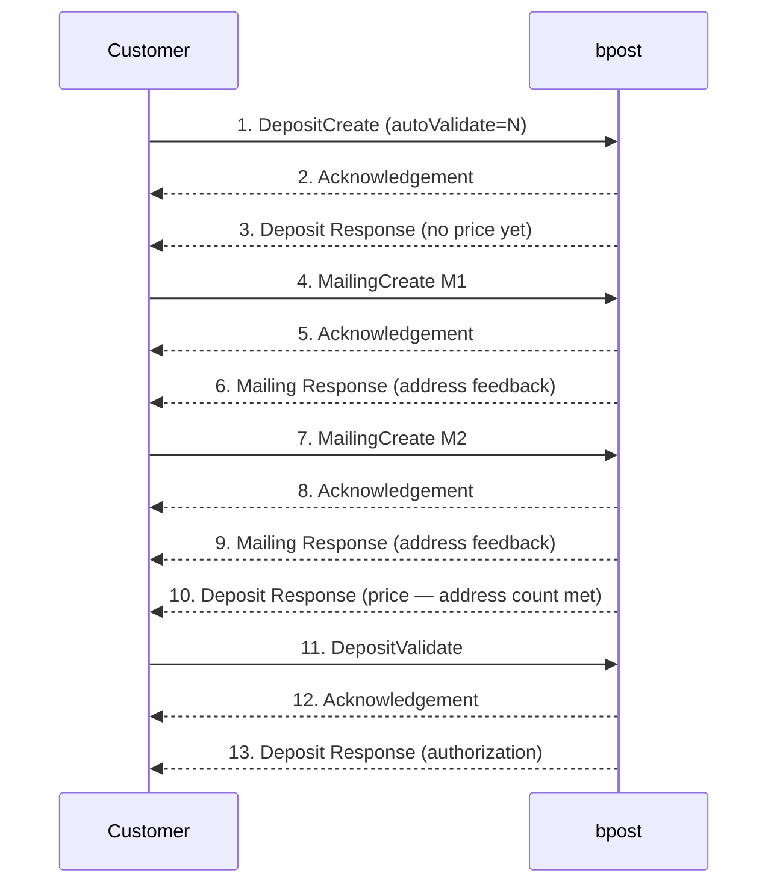
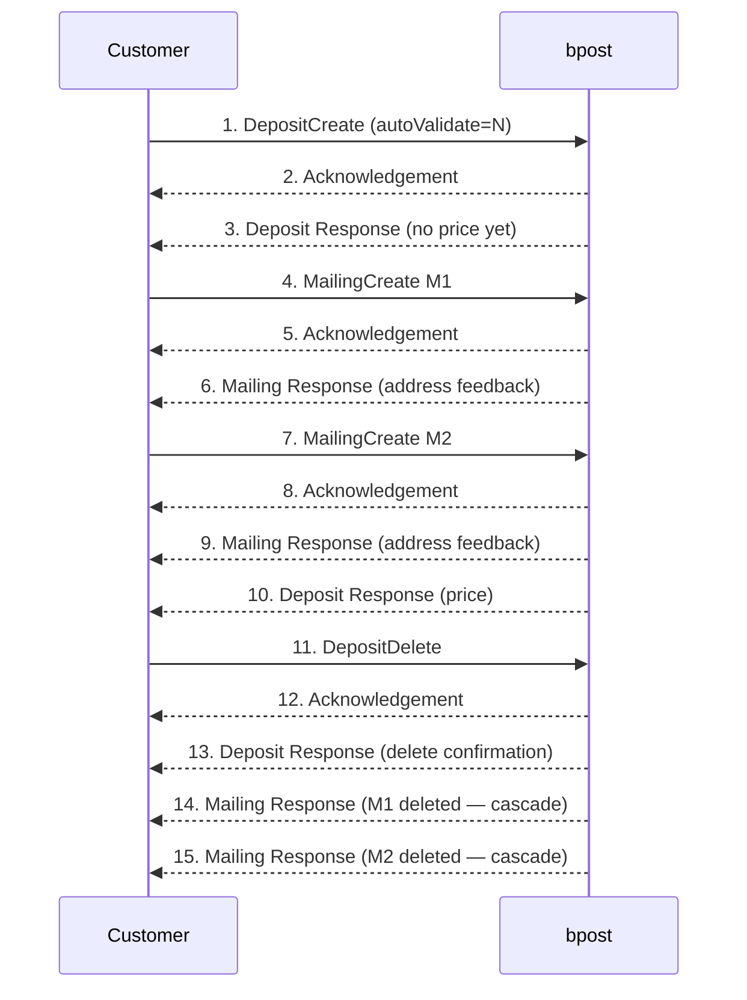
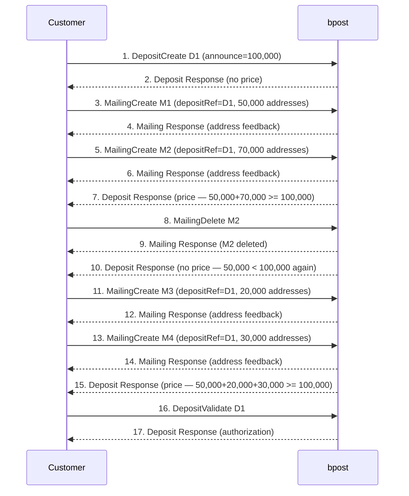

> **When to use this file:** When you need to understand the step-by-step sequence of deposit announcement scenarios -- creating, validating, updating, or deleting deposits, with or without multiple mailing files.

# Deposit Flows

## Overview

A deposit is an announcement of a physical mail delivery to bpost. Deposits can be created electronically via:

- **Webform**: Using the e-MassPost deposit announcement module (not covered in this technical guide)
- **Structured file**: Using the file exchange process described in this guide

This document covers the structured file approach. The deposit product is available for most MassPost products (Mail ID, Round & Sequence, and non-Mail ID products).

## Deposit Actions

| Action | Purpose |
|--------|---------|
| **DepositCreate** | Announce a new deposit |
| **DepositUpdate** | Modify an existing deposit (replaces all DepositCreate tags with DepositUpdate tags) |
| **DepositDelete** | Cancel a previously created deposit |
| **DepositValidate** | Confirm the deposit and receive authorization |

**Key rules:**
- Multiple actions (DepositCreate, DepositUpdate, DepositDelete, DepositValidate) can be combined in the same Deposit Request File.
- Each DepositCreate must be followed by a DepositValidate, unless the customer uses `autoValidate="Y"` in the DepositCreate action.
- After DepositValidate completes, a deposit authorization (PDF format) is provided. This must be presented at the MassPost dock when delivering the physical deposit.

See [../schemas/deposit-request.md](../schemas/deposit-request.md) for field-level details.

---

## Deposit-Only Scenarios

### Scenario 1: Deposit (Auto Validate = N)

A simple deposit announcement without autovalidation. The customer must explicitly validate after reviewing the price quote.

> **Source:** PDF page 53 — Figure 15: Deposit (Auto Validate = N)

The customer sends two separate Deposit Request Files: one with a DepositCreate action, and a second with a DepositValidate action.

### Scenario 2: Deposit (Auto Validate = Y)

A single-step deposit where creation and validation happen automatically.

> **Source:** PDF page 54 — Figure 16: Deposit (Auto Validate = Y)

The customer only needs to send one file. The response includes both the price and the authorization.

### Scenario 3: Deposit with Update

The customer creates a deposit, then modifies it (e.g., the number of mail pieces changed) before validating.

> **Source:** PDF page 55 — Figure 17: Deposit with Update

The customer sends three Deposit Request Files: one with DepositCreate, one with DepositUpdate, and one with DepositValidate.

### Scenario 4: Deposit Delete

The customer creates a deposit but later decides to cancel it (e.g., the marketing campaign was cancelled).

> **Source:** PDF page 55 — Figure 18: Deposit Delete

The customer sends two Deposit Request Files: one with DepositCreate and one with DepositDelete.

---

## Deposit Master Scenarios (with Multiple Mailing Files)

In these scenarios the deposit is the master and mailing files are linked to it. All deposit and mailing list requests can be uploaded via eMassPost application or via FTP.

### Scenario 5: Deposit with Multiple Mailing Files

The customer has a large campaign with addresses split across multiple mailing lists (e.g., 50,000 existing prospects + additional addresses from a market research bureau).

> **Source:** PDF page 56 — Figure 19: Deposit with multiple mailing files

**Key behavior:** The Deposit Response with price (step 10) is only sent once the total number of addresses in all linked mailing files meets or exceeds the number of announced mail pieces in the deposit. Before that, no price can be calculated.

### Scenario 6: Deposit Delete with Multiple Mailing Files

Same as Scenario 5 but the customer decides to cancel. Since the deposit is master, deleting it cascades to all linked mailing files.

> **Source:** PDF page 57 — Figure 20: Deposit Delete with multiple mailing files

**Key behavior:** Deleting the master (deposit) automatically deletes all its children (mailing files). bpost generates additional Mailing Response files confirming the deletion of each linked mailing.

### Scenario 7: Deposit Create with Mailing Delete

The customer creates a deposit with multiple mailings, then deletes one mailing and adds new ones. Demonstrates how price recalculation works.

> **Source:** PDF page 58 — Figure 21: Deposit Response

**Key behavior:** Every time an action impacts the total address count relative to the announced mail pieces, bpost recalculates and sends (or withdraws) the price. A previously communicated price becomes invalid when the address total drops below the announced count.

---

## Mailing File Master Scenario: Deposit Create with Mailing Delete (Figure 26)

When the Mailing Request file is master (one mailing, multiple deposits), the flow reverses. The mailing is created first, then deposits reference it.

> See [mail-id-flows.md — Figure 26: Mailing file Delete](mail-id-flows.md#scenario-mailing-file-delete-figure-26) for the full sequence diagram of this scenario.

**Key behavior:** Deleting the master (mailing) cascades to its children (deposits). The customer can also delete individual deposits without affecting the mailing.

## Price Calculation Rules

Anytime an action influences the price, bpost sends a Deposit Response with the calculated price. Actions that trigger recalculation include:
- Changing deposit characteristics
- Updating the announced number of mail pieces
- Creating or deleting a linked mailing file (changes total address count)
