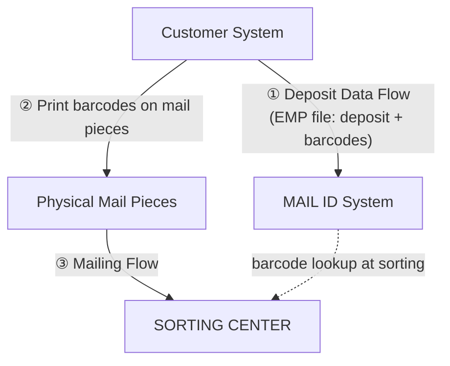
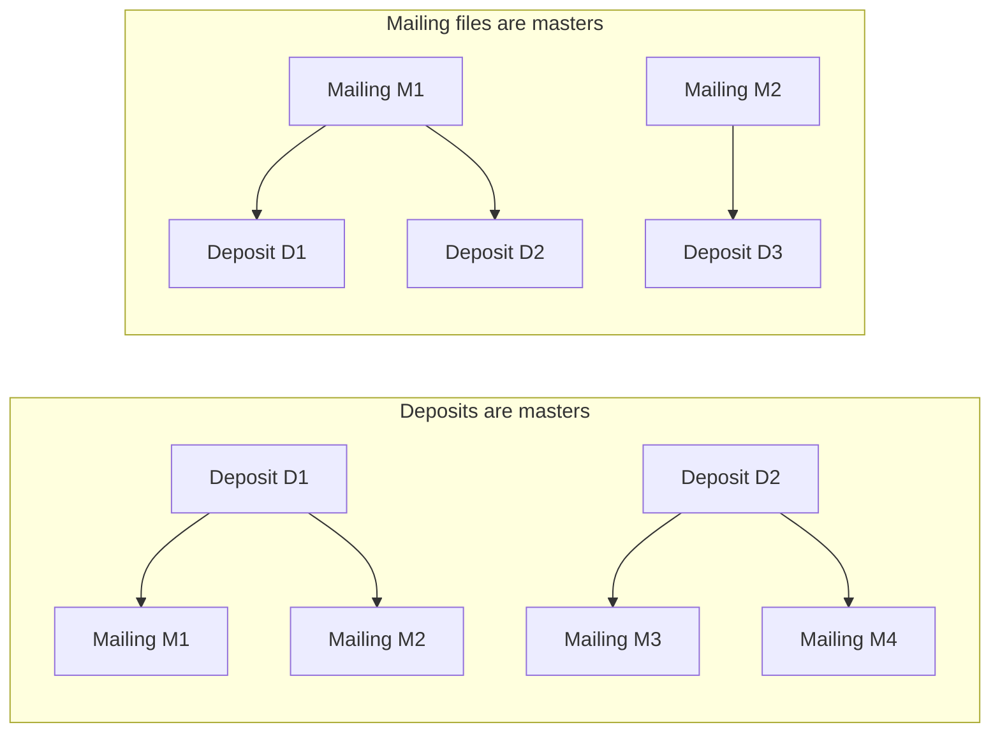
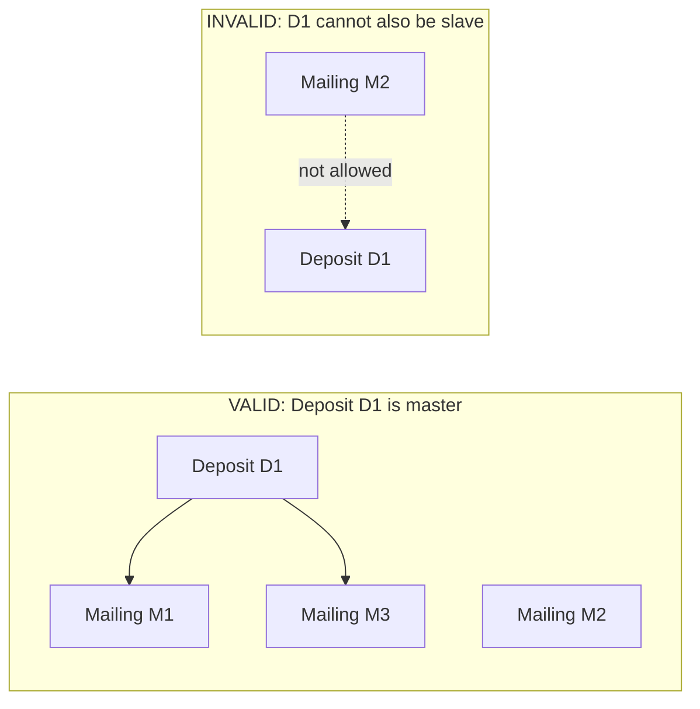
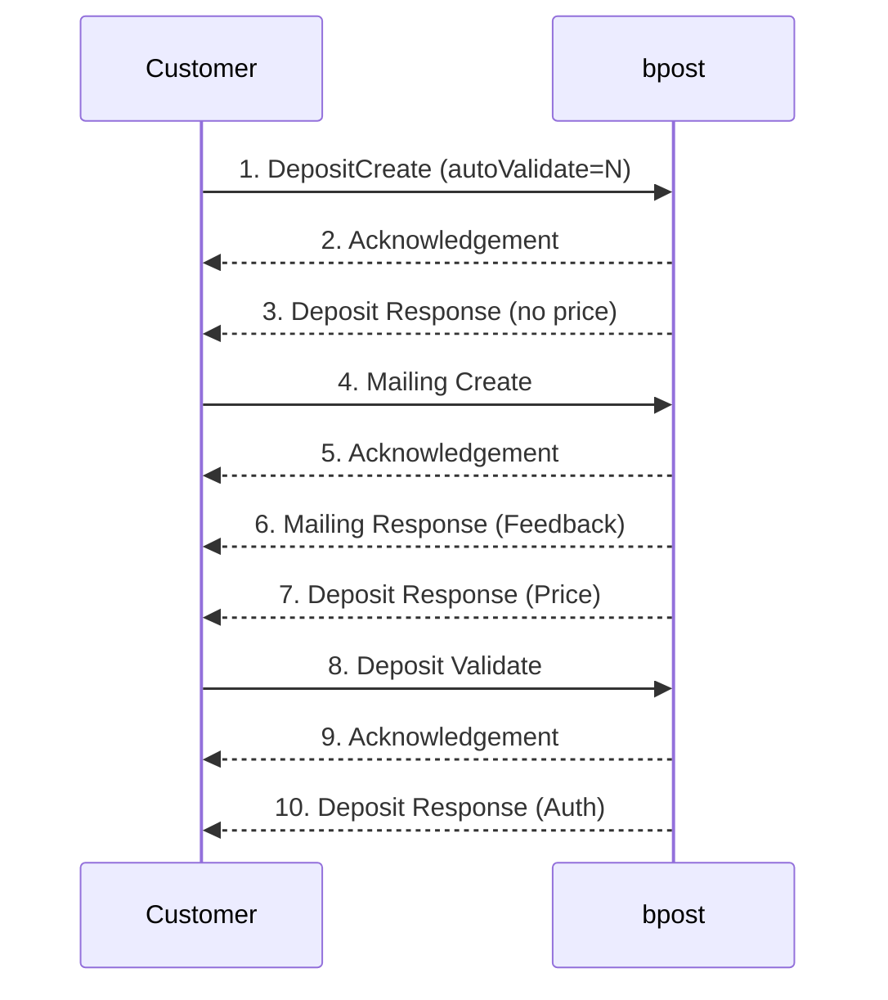
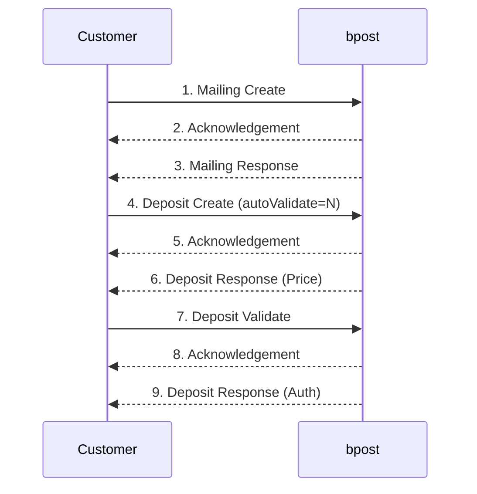
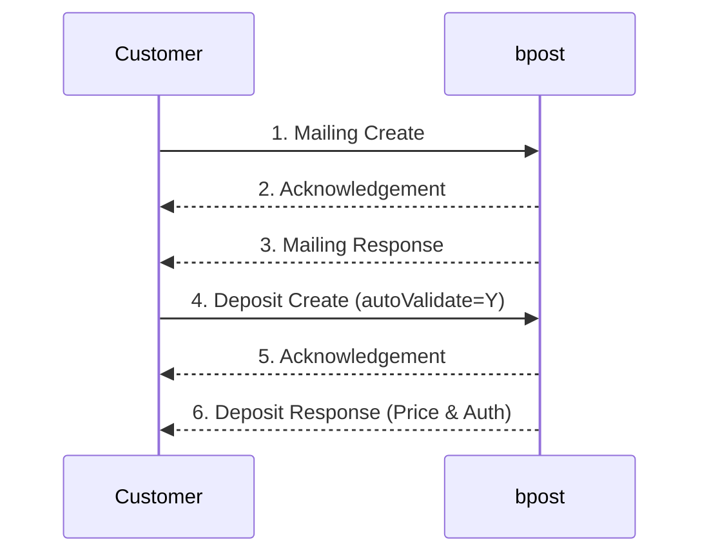
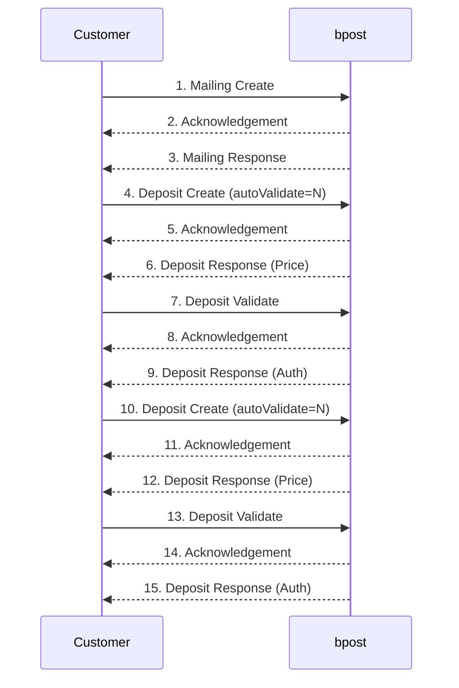
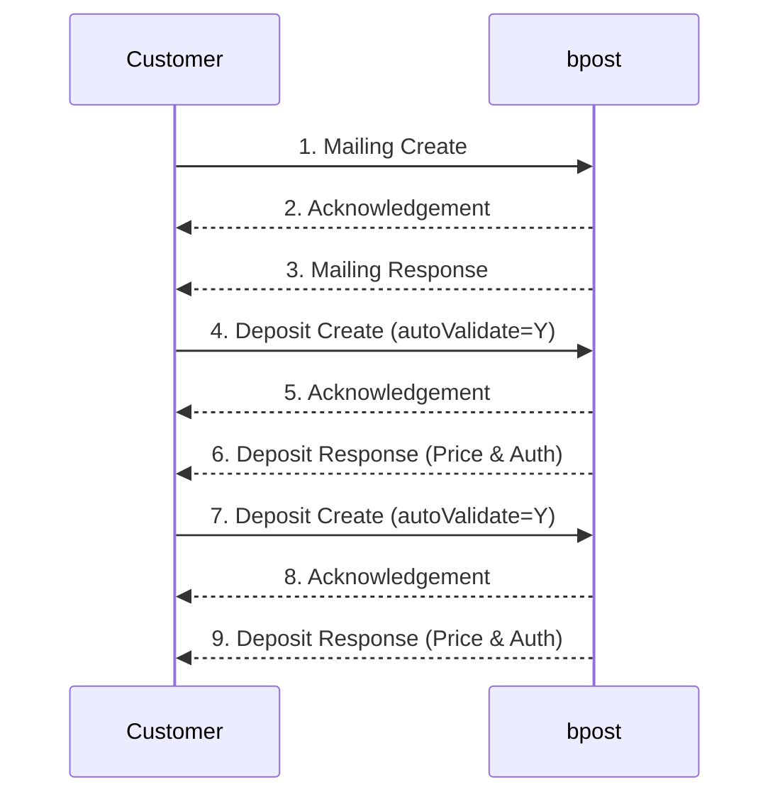
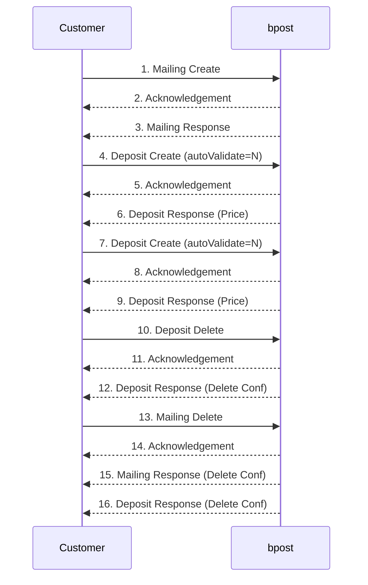

> **When to use this file:** When you need to understand the Mail ID deposit product -- how deposits and mailing files relate, the master/slave linking rules, and the end-to-end flow for Mail ID data exchange.

# Mail ID Deposit Flow

## What is Mail ID?

MAIL ID is a bpost innovation: a barcode generated by the customer or by bpost (on request). The barcode itself holds **no routing or sorting information** -- its only purpose is to **uniquely identify each mail piece**.

When preparing a Mail ID deposit:
- A unique MAIL ID barcode is generated for each mail piece (unique for at least 30 days)
- The customer generates a **mailing file** containing all MAIL ID barcodes for the deposit, along with destination addresses and (optionally) recipients
- This mailing file is sent to bpost **before** physical delivery of the mail

bpost then interprets the addresses in the mailing file and matches them to sorting information. At the sorting center, machines read the MAIL ID barcode on each mail piece and retrieve the corresponding address data to sort correctly.

### Process Overview (Figure 6)

> **Source:** PDF page 33 — Figure 6: MAIL ID Flows Schema

The sorting center uses the MAIL ID barcode to look up address data from step 1, enabling automated sorting.

## Data Exchange Options

There are two parallel data flows for Mail ID:
- **Deposit Data Flow** (EMP file): The deposit itself, announced via the EMP file format
- **Mailing Data Flow** (MID file): The address list linked to MAIL ID barcodes

Both flows use the Request/Acknowledgement/Response pattern. See [request-ack-response.md](request-ack-response.md) for the generic flow.

The customer can start printing addresses and barcodes before or after receiving feedback from bpost. The system allows flexibility -- the mailing file can be sent before or after the deposit file.

> **Note:** Customers can request that bpost generates the unique MAIL ID barcode numbers, but this means they must wait for bpost's feedback before printing.

## MID Flow: Actions

For mailings (MID file):

| Action | Purpose |
|--------|---------|
| **MailingCreate** | Create a new mailing (address list) |
| **MailingDelete** | Delete an existing mailing |

To **update** addresses in a mailing: delete the existing mailing (MailingDelete), then recreate it (MailingCreate). The mailingRef tag must be changed (and the fileRef tag too, if possible). Note that barcodes generated by bpost in the second MailingCreate will differ from the first batch -- only the latest barcodes are valid.

Multiple actions (MailingCreate and MailingDelete) can be combined within the same Mailing Request File.

---

## Linking Mailing and Deposit Files

When a customer uses the Mail ID product, they must create both a deposit and a mailing (address list). These two entities must be linked. The sequence of events can vary, but a link between the deposit and mailing transactions must always exist.

### Master/Slave Relationship (Figure 7)

> **Source:** PDF page 35 — Figure 7: Master – Slave Relationship

Deposits and mailing files can be related in one of two ways:

| Relationship | Description | Cardinality |
|-------------|-------------|-------------|
| **Deposit is master** | One or more mailing lists are linked to the same deposit | 1 deposit <-- 1 to N mailing lists |
| **Mailing is master** | One or more deposits are linked to the same destination address list | 1 to N deposits --> 1 mailing list |

### Master/Slave Rules (Figure 8)

> **Source:** PDF page 35 — Figure 8: Master – Slave Rules

**Critical constraint:** Once an item (deposit or mailing) is the master in a relationship, it may be linked to 1 to N slave items. However, a slave item can only be linked to **exactly 1 master item**.

**Example -- Deposit is master:** If Deposit D1 is master in a relationship with Mailing files M1 and M3, then D1 cannot also become a slave in a relationship with any other Mailing file (e.g., M2).

**Example -- Mailing is master:** If Mailing file M1 is master in a relationship with Deposits D2 and D3, then M1 cannot become a slave in a relationship with any Deposit.

---

## Flow: Deposit is Master (Figure 9)

The deposit is sent first, then mailing files reference it.

> **Source:** PDF page 36 — Figure 9: Deposit master

### Technical Linking Details (Deposit Master)

- **Step 1:** When the customer creates the deposit:
  - `depositRef` attribute must have a value (the unique customer reference for the deposit)
  - `mailingRef` attribute must be **empty**
- **Subsequent steps:** When the customer creates mailing files:
  - `mailingRef` attribute must have a value (unique customer reference for the mailing)
  - `depositRef` attribute must have the **same** value as specified in step 1

There are 2 ways to reference a deposit:
1. The deposit reference (contained in the deposit request in step 1)
2. The temporary number generated by bpost (the `tmpDepositNr`, given in step 3)

### Business Rules (Deposit Master)

- The master must be sent first. Mailing files may only be sent after both the Deposit Acknowledgement and Deposit Response have been generated by bpost.
- Each mail piece of the deposit must have a corresponding address in one of the mailing files. The total number of addresses across all related mailing files must be at least equal to the number of announced mail pieces in the deposit.
- Price is calculated using the compliance rate (ratio of interpreted addresses to total). A price cannot be determined:
  - While no mailing file has been received
  - When the total address records in linked mailing files is less than the number of announced mail pieces
- Every change (update deposit, delete mailing file, etc.) can impact the price.
- Deleting the deposit deletes all attached mailing files. Deleting a single mailing file does not delete the deposit.

---

## Flow: Mailing File is Master (Figure 10)

The mailing file is sent first, then deposits reference it.

> **Source:** PDF page 38 — Figure 10: Mailing file master

### Technical Linking Details (Mailing Master)

- **Step 1:** When the customer creates the mailing file:
  - `mailingRef` attribute must have a value (unique customer reference for the mailing)
  - `depositRef` attribute must be **empty**
- **Subsequent steps:** When the customer creates deposits:
  - `depositRef` attribute must have a value (unique customer reference for the deposit)
  - `mailingRef` attribute must have the **same** value as specified in step 1

The system will store one mailing file and one or more deposits, all linked to the mailing file.

### Business Rules (Mailing Master)

- The master must be sent first. Deposit Request files may only be sent after both the Mailing Acknowledgement and Mailing Response have been generated by bpost.
- Each address of the mailing file can be linked to only one physical piece of the related deposit(s), as the barcode of this address must be unique. The total number of addresses in the mailing file must be equal to or greater than the total number of related deposit file(s).
- Price is calculated using the compliance rate. Every change (update deposit, delete mailing file, etc.) can impact the price.
- Deleting the mailing file results in the deletion of all attached deposits. A delete of a single deposit does not impact the mailing file (all addresses remain available).

---

## Deposit Response (Price)

Anytime an action influences the price, bpost sends a DepositResponse with the calculated price. This includes:
- Changing the characteristics of a deposit
- Updating the announced number of pieces
- A MailingCreate or MailingDelete that changes the total address count

See [../schemas/deposit-response.md](../schemas/deposit-response.md) for field-level details.

## tmpDepositNr Concept

When bpost processes a DepositCreate, the Deposit Response includes a `tmpDepositNr` -- a temporary deposit number generated by bpost's application. This number can be used as an alternative way to reference the deposit in subsequent requests (instead of the customer's own `depositRef`).

---

## Mailing File Master Scenarios (Figures 22–26)

The following scenarios all use the **mailing file as master**. The mailing file is created first, then one or more deposits reference it.

### Scenario: Mailing file, one deposit (Auto Validate = N) (Figure 22)

> **Source:** PDF page 59 — Figure 22: Mailing file, one deposit (Auto Validate = N)

In this example the customer uses the mailing file as the master and develops the mailing file before developing the deposit file. The customer sends 3 files: the Mailing Request File with a mailingCreate action, the Deposit Request File with a depositCreate action and finally the Deposit Request File with a depositValidate action. Each of these will lead to the generation of the corresponding Acknowledgement and Response files.

### Scenario: Mailing file, one deposit (Auto Validate = Y) (Figure 23)

> **Source:** PDF page 60 — Figure 23: Mailing file, one deposit (Auto Validate = Y)

This flow is almost identical as the one above, except that the user does not need to send another Deposit Request File with the depositValidate action. This brings the number of files transferred from nine to six.

> **Note:** Number of mailing list items >= numbers of deposits create items so that auto validate works.

### Scenario: Mailing file, multiple deposits (Auto Validate = N) (Figure 24)

> **Source:** PDF page 61 — Figure 24: Mailing file, multiple deposits (Auto Validate = N)

In this case, the company would opt to create the mailing first and send the different deposit files afterwards. As described before, each time a file is sent, the system will generate the corresponding Acknowledgement and Response files. As in this case the autoValidate option is not used, each depositCreate action must be validated with a depositValidate action. Hence, five Request files are sent: one Mailing Request file with a mailingCreate action, and four Deposit Request files, two with a depositCreate action and 2 with a depositValidate action.

### Scenario: Mailing file, multiple deposits (Auto Validate = Y) (Figure 25)

> **Source:** PDF page 62 — Figure 25: Mailing file, multiple deposits (Auto Validate = Y)

This flow is almost identical as the flow above. The only difference is that there are only 9 file transfers instead of 15, because the autoValidate option is used.

### Scenario: Mailing file Delete (Figure 26)

> **Source:** PDF page 63 — Figure 26: Mailing file Delete

In this scenario, the mailing file is the master and there are two different deposits. The customer first sends a Mailing Request file with a mailingCreate action. One deposit is deleted (step 10), then the mailing itself is deleted (step 13), which cascades to delete the remaining linked deposit (step 16).
