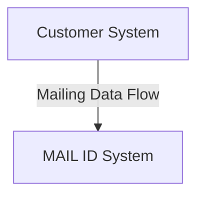
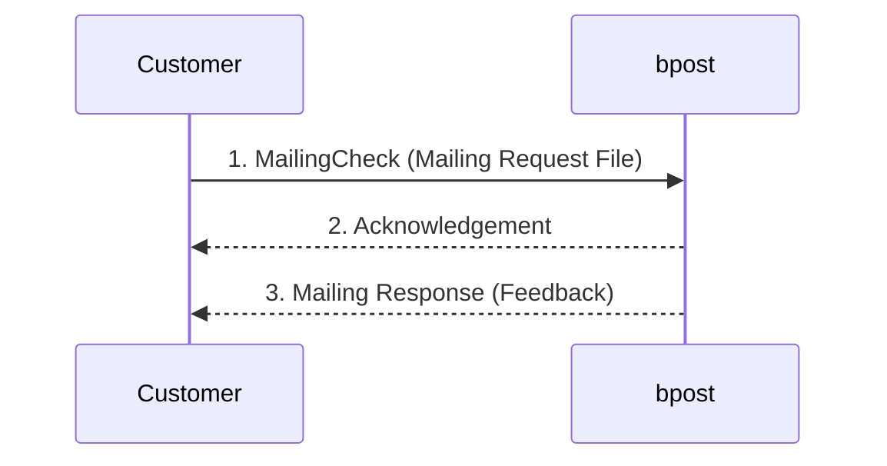

> **When to use this file:** When you need to understand the OptiAddress product -- address validation independent of any physical mail deposit, using the MailingCheck action type.

# OptiAddress Flow

## What is OptiAddress?

OptiAddress is bpost's **address validation tool**. It allows authorized mailers to submit addresses to the MAIL ID system for verification **independently of any deposit**. No physical mail delivery is needed -- the purpose is purely to validate and correct address data.

OptiAddress provides:
- Detailed error feedback on addresses
- The number of address records that were "interpreted" (matched to a known postal address)
- Suggestions for corrections on erroneous addresses (when possible)

> **Note:** "Interpreted" means the given address can be matched to an existing postal address. This does not necessarily mean the link between the addressee and the address is correct.

## How It Differs from Mail ID / R&S

| Aspect | Mail ID / R&S | OptiAddress |
|--------|--------------|-------------|
| Requires a deposit | Yes | **No** |
| Action type | MailingCreate | **MailingCheck** |
| Purpose | Sorting + delivery | **Address validation only** |
| Physical mail | Yes | No |
| Linked to deposit | Yes (master/slave) | Independent |

## Data Exchange Options

- OptiAddress is based on the **same platform as Mail ID** and uses the same electronic workflow and file structure
- Uses the **Mailing Files Syntax** (same as Mail ID)
- Data exchange for addresses can **only occur via structured file** (not webform)
- The customer must implement all requirements from Part I (FTP setup, file naming, etc.)

## Flow (Figure 14 + Figure 27)

> **Source:** PDF page 52 — Figure 14: OptiAddress Flows Schema

### Sequence Diagram: Mailing Check

> **Source:** PDF page 65 — Figure 27: Mailing Check

The flow follows the standard Request/Acknowledgement/Response pattern (see [request-ack-response.md](request-ack-response.md)):

1. The customer sends a **Mailing Request File** with a **MailingCheck** action containing the addresses to validate
2. bpost generates a **Mailing Acknowledgement** file confirming receipt
3. bpost processes the data and generates a **Mailing Response** file containing:
   - The number of addresses that were interpreted (matched)
   - Detailed error feedback for addresses that could not be interpreted
   - Correction suggestions for erroneous addresses (when possible)

## Key Points

- The MailingCheck action is the **only action type** used for OptiAddress. Do not use MailingCreate or MailingDelete.
- It is possible to combine both MailingCheck and other actions (MailingCreate, MailingDelete) in the same file, if all specifications of the mailings are known at that time. All actions belonging to the same file syntax can be combined.
- No `depositRef` or `mailingRef` linking is needed since OptiAddress operates independently.
- The Mailing Response file format is the same structure used for Mail ID responses, but the content focuses on address validation feedback rather than sorting information.

See [../schemas/mailing-request.md](../schemas/mailing-request.md) for field-level details on the MailingCheck action.
See [../schemas/mailing-response.md](../schemas/mailing-response.md) for field-level details on the validation feedback format.
