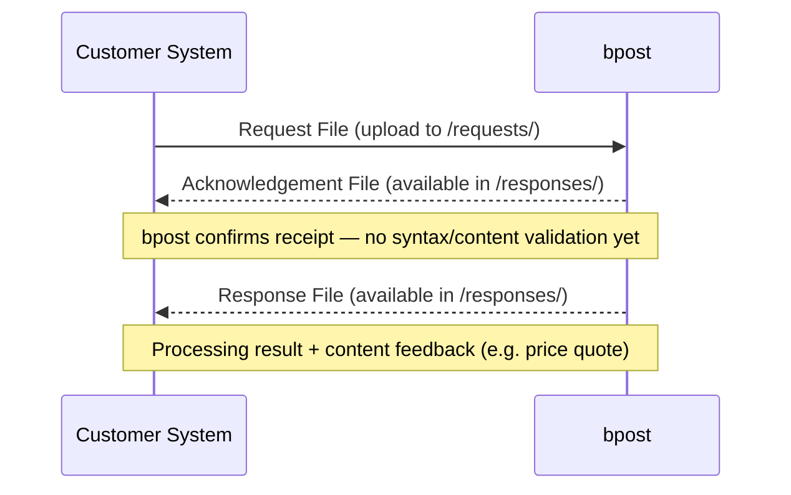

> **When to use this file:** When you need to understand the generic data exchange pattern between customer and bpost -- this Request/Acknowledgement/Response flow applies to ALL products (deposits, mailings, OptiAddress).

# Generic File Flow: Request, Acknowledgement, Response

## Overview

> **Source:** PDF page 009 — Figure 2: Steps of the overall process

All data exchanges between customer and bpost follow the same three-step pattern. The customer always initiates communication -- bpost never pushes unsolicited files.

### Flow (Figure 3)

> **Source:** PDF page 018 — Figure 3: Generic File Flow (Request, Acknowledgement, Response)

**Step 1 -- Request File:** The customer uploads a structured file to bpost's system. This is the only step initiated by the customer.

**Step 2 -- Acknowledgement File:** bpost immediately confirms receipt of the file. The acknowledgement only reports that the file was received -- it does NOT validate syntax or content correctness.

**Step 3 -- Response File:** After processing, bpost generates a Response File. This file indicates whether processing succeeded (including the reason if it failed) and provides feedback on the content (e.g., a price quote for a deposit request).

> **Important:** The good processing of the Request File is NOT guaranteed before the Response File is available. There is no guaranteed timing between acknowledgement and response.

## File Availability

Files generated by bpost (Acknowledgement and Response) are placed in the customer's directory on the FTP server. The customer must:

- **Poll/download** the files by initiating the data exchange themselves
- Optionally **sign up for email notifications** indicating a Response File is ready for download (typically available within a few minutes)

## Folder Management

- After a customer uploads a Request File, bpost removes it from the `/requests/` directory after loading it.
- After bpost provides an Acknowledgement or Response in the `/responses/` directory, the customer must delete the file after downloading it.
- The receiving party is always responsible for cleaning up files after processing.

## Generic File Structures

### Request File (Figure 4)

The Request File is created by the customer and has the following structure:

| Section | Required | Description |
|---------|----------|-------------|
| **Context** | Yes | Metadata about the file (sender, timestamps, etc.) |
| **Header** | Yes | File-level information (product type, customer ID, etc.) |
| **Action 1..n** | Yes (at least one) | One or more action sections |

A Mailing Request file can contain three types of actions:

1. **MailingCreate** -- create a new mailing (address list)
2. **MailingDelete** -- delete an existing, previously created mailing
3. **MailingCheck** -- verify addresses using the OptiAddress option, independently of a physical mail deposit

Multiple actions can be combined within the same Request File.

See [../schemas/deposit-request.md](../schemas/deposit-request.md) for field-level details on deposit request files.

### Acknowledgement File

The Acknowledgement File is simple and straightforward. It only confirms that the Request File was received. It does not contain processing results or validation feedback. See Part III File Syntax for the detailed structure.

### Response File (Figure 5)

The Response File is created by bpost after processing and has the following structure:

| Section | Required | Description |
|---------|----------|-------------|
| **Context** | Yes | Metadata about the response |
| **Header** | Yes | File-level information |
| **Replies** | Optional | Error/info messages for the Context and Header sections |
| **Action 1..n** | Yes (one per action in the Request) | One action section for each action from the corresponding Request File |

Each Action section in the Response may include optional **Replies** containing errors and/or messages related to that specific action.

## Key Rules

- All communication is customer-initiated (both sending requests and retrieving responses).
- One Request File can contain multiple actions (e.g., multiple DepositCreate + DepositValidate in one file).
- Each DepositCreate must be followed by a DepositValidate (unless autoValidation is set to "Y").
- The Acknowledgement is NOT a guarantee of successful processing -- always check the Response File for results.
