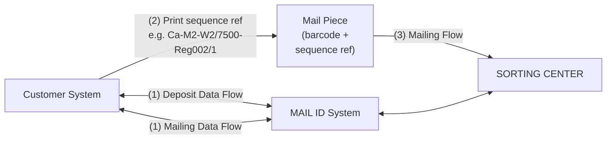

> **When to use this file:** When you need to understand Round & Sequence deposits -- the flow is similar to Mail ID but includes sequence references that must be printed on envelopes, and it applies only to "Large" format mail.

# Round & Sequence Deposit Flow

## What is Round & Sequence?

Round & Sequence (R&S) is used **only for "Large" format** mail. It is fundamentally the same as a Mail ID deposit: both use barcodes and address data. The key difference is that for R&S, in addition to a barcode, bpost returns a **sequence reference** in the Response file. This sequence reference must be printed on the envelope and allows the customer to **pre-sort the deposit** before delivering it to the MassPost dock.

> **Important:** To use Round & Sequence, the customer needs to overrun a specific certification.

## How It Works (Figure 11)

> **Source:** PDF page 40 — Figure 11: Round & Sequence Flows Schema



The system works identically to Mail ID: the deposit data flow and mailing data flow both go to the MAIL ID system, and the physical mail goes to the sorting center. The addition is the sequence reference that gets printed on each mail piece.

## Data Exchange Options

The data exchange options are the **same as Mail ID** -- see [mail-id-flows.md](mail-id-flows.md) for the deposit-master and mailing-master patterns, linking rules, and master/slave relationships.

Key differences from Mail ID:

- Barcodes are needed for each address
- The `FileInfo` tag of the Mailing Request file must specify `"RS1"` (for Round & Sequence deposit), not `"MID2"` (which is for Mail ID deposit)
- An extra attribute is available at the Format tag: `sortingMode`, with two possible values:
  - **"PO"** (Print Order): Mail pieces in the Response file are ordered following the print order requested for the presetting
  - **"CU"** (Customer way): Mail pieces are ordered following the same order as in the Request file

## Sequence Reference

### General Information

The sorting information is based on MAIL ID technology. However, the uploaded MAIL ID file (Request file) contains tags (Format and FileInfo) with other data than for classic Mail ID.

The Response file contains, for each mail piece, information about:

- Distribution order
- Ease of printing and conditioning of the mailing

Each mail piece record in the XML Response file includes:

| Field           | Description                                     | Print on envelope? |
| --------------- | ----------------------------------------------- | ------------------ |
| `prtOrder`      | The order for presetting (based on sortingMode) | No                 |
| `seq`           | The mail piece order in the Request file        | No                 |
| `fieldToPrint1` | Pre-sorting info field 1 (8 digits)             | Yes                |
| `fieldToPrint2` | Pre-sorting info field 2 (12 digits)            | Yes                |
| `fieldToPrint3` | Pre-sorting info field 3                        | Yes                |
| `orgInfo`       | Original info (not always present)              | No                 |

The four "last" fields are conditioning information indicating whether a particular mail piece is the first and/or last one for a sorting center ("ctr"), a machine ("mach"), a wave ("wav") or a distribution office ("uff"). Possible values: "Begin", "End", and "Begin_End" (when the mail piece is the only one for that sorting level). These should **not** be printed on the mail pieces.

### Structure (printed on envelope)

The sequence reference printed on the envelope has this 30-character format:

```
Position  1-8:   fieldToPrint1 (or "Overflow" when no office was found)
Position  9:     "/" separator between fieldToPrint1 and fieldToPrint2
Position 10-21:  fieldToPrint2
Position 22:     "/" separator between fieldToPrint2 and fieldToPrint3
Position 23-27:  up to 5 digits for the sequence of the postal destination in the round
Position 28-30:  3 space characters (reserved for future use)
```

**Examples:**

- `Ga-M3-W5/9000-Res-147/490`
- `La-M5-W1/0299-No-Rte/99999`

### Printing Guidelines

When printing the sequence reference on the envelope:

- Must be placed at the **right side and above** the address
- Must be printed in **bold and/or underlined**
- Minimum font size must be identical to the address font size
- A blank line must separate the sequence reference from the address

**Example placement on envelope:**

```
                              Cb-M2-W2/7500-Reg-002/1

                              Monsieur Jacques Dupont
                              Chaussee de Bruxelles 24
                              7500 Tournai
```

## Flow Diagrams

The sequence diagrams for R&S deposits are the same as for Mail ID. Refer to [deposit-flows.md](deposit-flows.md) for:

- Deposit-only scenarios (auto validate Y/N, update, delete)
- Deposit master scenarios (multiple mailing files, delete with multiple mailings)
- Mailing master scenarios

And refer to [mail-id-flows.md](mail-id-flows.md) for master/slave linking rules and business rules, which apply identically to R&S.

See [../schemas/mailing-request.md](../schemas/mailing-request.md) for field-level details on the Mailing Request file format.
See [../schemas/mailing-response.md](../schemas/mailing-response.md) for field-level details on the Mailing Response file format.
