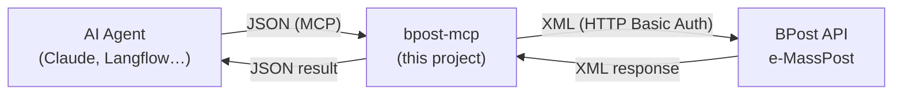
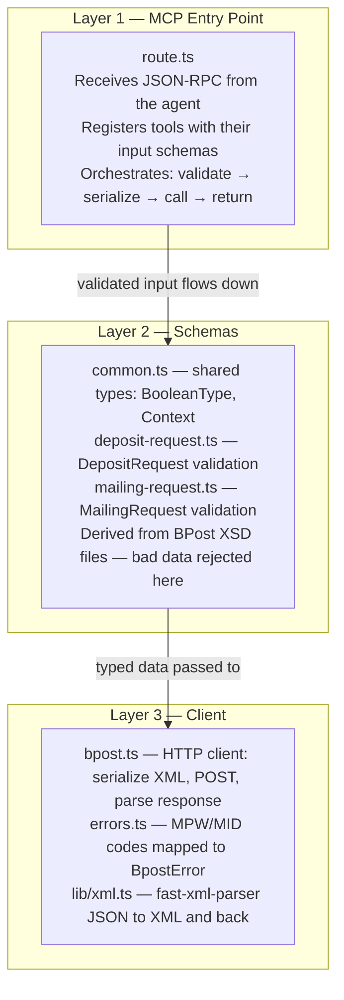
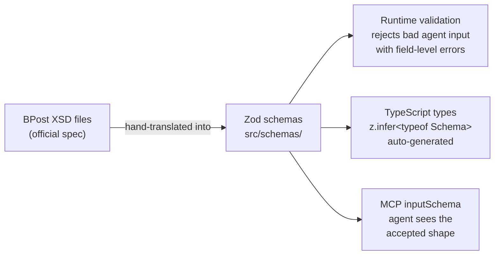
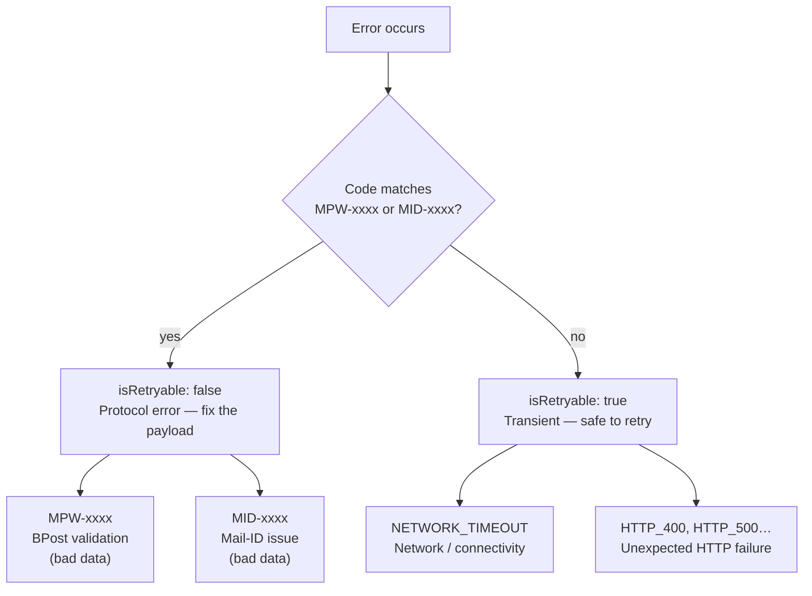

# Phase 1 Architecture Overview

**What is this?** A plain-language explanation of what was built, how it fits together, and why each piece exists.

---

## The Big Picture

BPost has an API called **e-MassPost** that lets companies announce batches of letters they want sorted and delivered. The API is old-school: it only speaks **XML**, uses **HTTP Basic Auth**, and has strict field rules defined in XSD schemas.

The problem: AI agents (like Claude) work in JSON and don't know anything about BPost's XML format or protocol rules.

**What we built** is a bridge — an **MCP server** that sits between an AI agent and BPost:



The agent sends structured JSON. The MCP server validates it, converts it to XML, calls BPost, and hands the result back as JSON. The agent never touches XML.

---

## What is MCP?

**MCP (Model Context Protocol)** is an open standard by Anthropic. It lets AI agents call external tools over HTTP — similar to how a browser calls a REST API, but designed specifically for AI workflows.

The agent sends a JSON-RPC message like:
```json
{
  "method": "tools/call",
  "params": {
    "name": "bpost_announce_deposit",
    "arguments": { "Context": {...}, "Header": {...}, "DepositCreate": [...] }
  }
}
```

The MCP server responds with a structured result (or error).

**We expose two tools:**

| Tool name | What it does |
|---|---|
| `bpost_announce_deposit` | Announce a deposit batch (letters handed to BPost for sorting) |
| `bpost_announce_mailing` | Announce a mailing batch (Mail-ID tracking records) |

---

## The Three Layers

The project is split into three independent layers, each with a clear job:



---

## A Request, Step by Step

Here is what happens when the AI agent calls `bpost_announce_deposit`:

```mermaid
sequenceDiagram
    participant Agent as AI Agent
    participant Route as route.ts (MCP handler)
    participant Zod as DepositRequestSchema (Zod)
    participant Client as BpostClient
    participant BPost as BPost API

    Agent->>Route: POST /api/mcp<br/>tools/call: bpost_announce_deposit { ... }

    Route->>Zod: validate input
    alt invalid payload
        Zod-->>Agent: validation error (field-level detail)
    end

    Route->>Client: createBpostClient()<br/>(reads env: BPOST_USERNAME, BPOST_PASSWORD)
    Route->>Client: sendDepositRequest(buildXml(input))

    Client->>BPost: POST https://www.bpost.be/emasspost<br/>Content-Type: application/xml; charset=ISO-8859-1<br/>Authorization: Basic …<br/>Body: &lt;DepositRequest&gt;…&lt;/DepositRequest&gt;

    alt Network failure
        BPost--xClient: fetch error
        Client-->>Route: BpostError(NETWORK_TIMEOUT, retryable: true)
        Route-->>Agent: { isError: true, code: "NETWORK_TIMEOUT", retryable: true }
    else HTTP 4xx / 5xx
        BPost-->>Client: &lt;Error code="MPW-4010"&gt;Invalid sender&lt;/Error&gt;
        Client-->>Route: BpostError(MPW-4010, retryable: false)
        Route-->>Agent: { isError: true, code: "MPW-4010", retryable: false }
    else HTTP 200
        BPost-->>Client: &lt;DepositResponse&gt;…&lt;/DepositResponse&gt;
        Client-->>Route: parsed JS object
        Route-->>Agent: { content: [{ type: "text", text: "{ … }" }] }
    end
```

---

## The Schema System

The schemas are the heart of the project. They do three things at once:

1. **Describe the shape** of a valid request (what fields exist, what types they must be)
2. **Validate** incoming data from the agent (reject bad payloads before calling BPost)
3. **Generate TypeScript types** automatically — no manual type definitions



### Context: The Routing Header

Every BPost request starts with a `<Context>` element that tells BPost which system and protocol version you're using. The values are fixed — you can't choose them:

| Field | DepositRequest | MailingRequest |
|---|---|---|
| `requestName` | `DepositRequest` | `MailingRequest` |
| `dataset` | `M004_MPA` | `M037_MID` |
| `receiver` | `EMP` | `MID` |
| `version` | `0100` | `0200` |
| `sender` | your BPost customer number | your BPost customer number |

Because the two request types have different fixed values, we have two separate context schemas (`DepositContextSchema` and `MailingContextSchema`). The Zod schema enforces the correct values at parse time — the agent can't accidentally send `M004_MPA` with a MailingRequest.

---

## Error Handling

Errors are classified at the source and tagged with `isRetryable`:



The agent receives a structured error object:
```json
{
  "code": "MPW-4010",
  "message": "Invalid sender identifier",
  "retryable": false
}
```

This lets an AI workflow decide whether to retry automatically or escalate to the user.

---

## File Map

```
bpost-mcp/
│
├── src/
│   ├── app/api/mcp/
│   │   └── route.ts              ← MCP HTTP endpoint (Next.js App Router)
│   │                               Registers tools, handles POST /api/mcp
│   │
│   ├── schemas/
│   │   ├── common.ts             ← Shared types: BooleanType, DepositContext,
│   │   │                           MailingContext, Context (union)
│   │   ├── deposit-request.ts    ← DepositRequestSchema + type
│   │   └── mailing-request.ts    ← MailingRequestSchema + type
│   │
│   ├── client/
│   │   ├── bpost.ts              ← BpostClient class + createBpostClient factory
│   │   └── errors.ts             ← BpostError class + parseBpostError function
│   │
│   └── lib/
│       └── xml.ts                ← fast-xml-parser singletons: buildXml / parseXml
│
├── tests/
│   ├── schemas/
│   │   ├── common.test.ts        ← BooleanType and Context validation tests
│   │   ├── deposit-request.test.ts
│   │   └── mailing-request.test.ts
│   ├── client/
│   │   ├── bpost.test.ts         ← HTTP client tests (mocked fetch)
│   │   └── errors.test.ts        ← Error classification tests
│   └── mcp/
│       └── route.test.ts         ← MCP tools/list integration test
│
├── docs/
│   ├── internal/
│   │   ├── e-masspost/           ← BPost protocol documentation (skills submodule)
│   │   │   └── skills/e-masspost-protocol/
│   │   │       ├── resources/    ← Official BPost XSD files (source of truth)
│   │   │       ├── schemas/      ← Human-readable field specs
│   │   │       └── transport/    ← HTTP/FTP protocol details
│   │   ├── project-design.md     ← Architecture decisions log
│   │   └── phase1-architecture.md ← This file
│   └── samples/                  ← Example JSON/XML payloads for testing
│
├── .env.local                    ← BPOST_USERNAME + BPOST_PASSWORD (never committed)
├── next.config.ts                ← Next.js config
├── vitest.config.ts              ← Test runner config
└── package.json
```

---

## Technology Choices

| What | Tool | Why |
|---|---|---|
| **Web framework** | Next.js 16 (App Router) | Deploys to Vercel with zero config; App Router gives us clean API routes |
| **MCP server** | `@modelcontextprotocol/sdk` v1.29 | Official Anthropic SDK; handles JSON-RPC protocol, tool registration, streaming |
| **Validation** | Zod v4 | Schema-first: one definition gives you runtime validation + TypeScript types |
| **XML** | `fast-xml-parser` v5 | Pure TypeScript, no native deps, handles ISO-8859-1 (BPost's encoding), predictable JS objects |
| **Tests** | Vitest 4 | Fast, TypeScript-native, compatible with `@/` path aliases via vite-tsconfig-paths |
| **Hosting** | Vercel | Serverless, globally distributed, zero-config Next.js deployment |

---

## What's Not Built Yet (Phase 2+)

The action sub-schemas are currently stubs — they accept any data. The envelope validation (Context, Header, which action type) is fully enforced, but the individual record fields inside `DepositCreate`, `MailingCreate`, etc. are not yet validated against the XSD field specs.

Phase 2 will expand these stubs into full schemas, field by field, using the XSD files in `docs/internal/e-masspost/skills/e-masspost-protocol/resources/`.
