# Website

De webapp is een Next.js-app (App Router) in `src/app/`. Ze is in alfa; de flows voor het indienen van mailinglijsten en een projectoverzicht bestaan nog niet. Het ontwerp ervan staat onder [Geplande flow voor mailings](#geplande-flow-voor-mailings-ontwerp).

## Pagina's

| Pad | Bestand | Wat |
|---|---|---|
| `/` | `src/app/page.tsx` | Startpagina |
| `/dashboard` | `src/app/dashboard/page.tsx` | Accountinstellingen: bpost-gegevens, barcode-instellingen, app-tokens. Vereist aanmelding |
| `/install` | `src/app/install/page.tsx` | Installatie-instructies voor de AI-assistent |
| `/reference` | `src/app/reference/page.tsx` | Statische transparantiepagina met tool- en instructieteksten (`src/generated/tool-registry.json`) |

## Aanmelden

Auth.js (NextAuth v5) met één provider, Google (`src/lib/auth.ts`).
- Het sessiebeheer gaat via de Drizzle-adapter naar Neon Postgres.
- Bij de eerste aanmelding (`createUser`) wordt een tenant aangemaakt en aan de gebruiker gekoppeld. Heeft een bestaande gebruiker er nog geen, dan gebeurt dat bij `signIn`.
- Routes: `/api/auth/*` (extern beheerd door Auth.js, niet in de OpenAPI-spec).
- Zonder sessie stuurt `/dashboard` door naar `/api/auth/signin?callbackUrl=/dashboard`.

## Lokaal draaien

```bash
npm ci
cp .env.example .env.local   # waarden invullen, zie Hosting en omgevingsvariabelen
npm run dev
```

Het dashboard bewaart het bpost-wachtwoord versleuteld (AES-256-GCM, `ENCRYPTION_KEY`).

## Geplande flow voor mailings (ontwerp)

Ontwerp van 2 oktober 2026, nog niet gebouwd. De library en de API komen eerst, deze schermen daarna. Het ontwerp gaat uit van het Centraal model: de adressen staan in onze database. Die keuze is nog open, zie [Architectuurmodellen](architectuurmodellen.md).

Een mailing doorloopt vijf stappen. Elke stap heeft een eigen icoon, dat de gebruiker ook in het overzicht ziet. De kleur van een vak toont wie aan zet is.


1. **Opladen:** een .xlsx-bestand tot 25.000 adressen. De server leest het in het geheugen in en zet alle kolommen in de database. Het bestand zelf wordt niet bewaard.
2. **Koppelen:** elke kolom krijgt een rol: adres, context (bewaren en tonen bij het corrigeren) of niet bewaren. De export van Contrapunt wordt herkend.
3. **Formaatvalidatie:** de rijen worden nagekeken op de regels van bpost: tekens, lengte van de velden, verplichte velden en gekoppelde kolommen. Per formaatfout komt een voorstel dat de gebruiker bevestigt of aanpast. Zonder formaatfouten gaat de mailing vanzelf verder. Op het scherm staat onder de titel: "Voldoet je lijst aan de regels van bpost? We kijken de tekens, de lengte van elk veld, de verplichte velden en de gekoppelde kolommen na."
4. **Adrescontrole:** een `MailingCheck` bij bpost. Onder 96 % is een nieuwe controle verplicht, tussen 96 en 98 % volgt een waarschuwing.
5. **Indienen:** een `MailingCreate`. Daarna ligt alles vast; wijzigen kan enkel door in te trekken en opnieuw in te dienen.

Na de deposit, die buiten de app in het bpost-portaal gebeurt, markeert een gebruiker de mailing als afgegeven. 30 dagen later worden de adressen gewist. Het logboek blijft bewaard.



Een toestand wisselt enkel na een bevestigd feit, zoals een geslaagde upload of een antwoord van bpost. Mislukt iets aan onze kant, dan blijft de toestand staan en verschijnt er een foutmelding. Weigert bpost de indiening (Status 998 of 999), dan gaat de mailing terug naar Gecontroleerd. Voor de gebruiker vallen de toestanden samen tot drie statussen: wachten, actie nodig en klaar.
