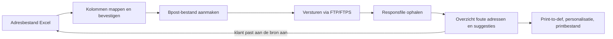

# Architectuur


Concept ter nazicht. Dit beschrijft de bedoelde werkwijze en onderdelen, niet de definitieve technische keuzes. Die hangen af van de open vragen.


## Werkwijze

Elke stap met een mens ertussen is bewust: de gebruiker bevestigt de mapping, beoordeelt de suggesties en beslist wat terug naar de klant gaat.

## Onderdelen

| Onderdeel            | Rol                                                                                            | Stand                                    |
| -------------------- | ---------------------------------------------------------------------------------------------- | ---------------------------------------- |
| Kennisbasis en skill | Bpost-documentatie en protocol (bestanden, foutcodes, FTP/HTTP), bruikbaar door AI-assistenten | Klaar, wordt bijgewerkt                  |
| Library              | Excel inlezen, kolommen mappen, bpost-bestand opbouwen, response verwerken                     | In ontwikkeling, mapping-suggestie is af |
| API                  | Dunne laag boven op de library, zodat scripts en interface dezelfde logica gebruiken           | Net gestart                              |
| Interface            | Upload, mappingscherm met live voorbeeld, overzicht van adressen en suggesties                 | Enkele onderdelen worden al uitgewerkt   |
| Versturen en ophalen | FTP/FTPS naar bpost, ophalen van responses, melding bij resultaat                              | Gepland                                  |
| MCP en AI-assistent  | Veiligere MCP bovenop de API, of een assistent in de interface                                 | Later, de eerste versie werkt zonder LLM |

## Fasen

| Fase                       | Resultaat                                                                          | Stand                              |
| -------------------------- | ---------------------------------------------------------------------------------- | ---------------------------------- |
| 1. Documentatie naar skill | Bpost e-MassPost skill                                                             | Klaar                              |
| 2. Library naar plugin     | Library die samen met de skill als plugin voor AI-assistenten uitgerold kan worden | Voorlopig theoretisch              |
| 3. API naar website        | API op basis van de functies, plus een website die de API gebruikt                 | Actief, focus van de komende weken |
| 4. MCP naar assistent      | Herziene MCP of een assistent in de website                                        | Later                              |

## Randvoorwaarden voor het ontwerp

* Dezelfde bouwstenen voor script, API en interface, zodat de logica maar één keer bestaat.
* Geen adressen naar externe AI-modellen.
* Verpakt als container, zodat de applicatie zowel in de cloud als intern bij Contrapunt kan draaien.
* Dataverwijdering na afronding van een mailing is een ontwerpvereiste, ook als de eerste versie dit nog niet volledig invult.
