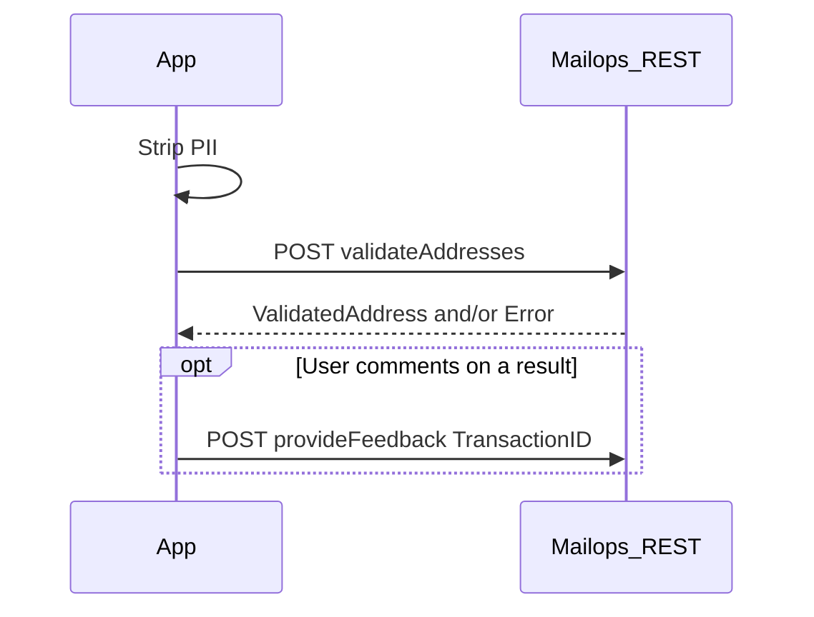

> **When to use this file:** Interpreting validateAddresses outcomes (exact match, anomalies, no match, suggestions).

# Validation outcomes

Interpretation is tolerant of some typos but **not guaranteed**. Review
feedback before writing it back to a customer database.

| Outcome | Typical signals | What to do |
|---|---|---|
| Exact match | No `Error`; official address equals input (often UPPERCASE) | Accept official spelling |
| Match + anomalies | `warning` on a component; official street/city differs | Prefer bpost version for mail; show the field |
| Partial match | `error` on house number / box; street+town exist | User must fix the missing/wrong part; no auto-correction |
| Multiple matches | Several `ValidatedAddress` rows (e.g. missing postcode) | User picks one |
| No match + suggestions | `address_not_recognized` + suggestion list + scores | Offer suggestions; do not auto-apply blindly |
| No match | `error` without useful `ComponentRef` | Manual review; may be a brand-new address |

## Sequence

`provideFeedback`: `TransactionID` + free-text `FeedbackDescription` + optional
`CallerName`. Stored by bpost for quality; not a correction API.

Interactive equivalent: http://bpost.be/validationadresse
